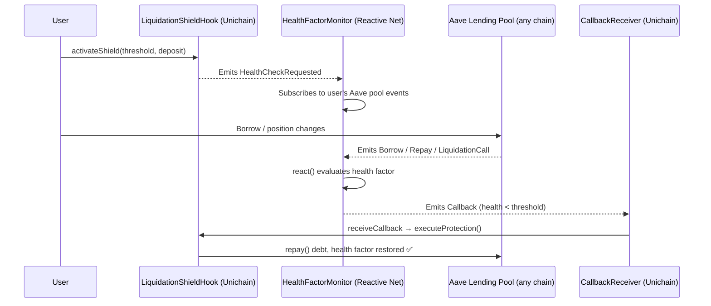

# 🛡️ LiquidationShield: Trustless Cross-Chain Liquidation Protection


**LiquidationShield** is a fully on-chain, trustless liquidation protection system that automatically defends your DeFi lending positions across any EVM chain — 24/7, without keepers, bots, or custody risk. By leveraging the **Reactive Network** as a cross-chain event brain and integrating **Uniswap v4 Hooks** as an atomic execution layer, it monitors your health factor in real time and repays debt before liquidators can strike.

---

## 🎯 The Problems It Solves

> [!IMPORTANT]
> 1. **Sleepless Risk**: Lending positions on Aave and Compound can be liquidated at 3 AM while you sleep — losing 5–15% instantly to liquidation penalties.
> 2. **Cross-Chain Blindness**: Monitoring positions manually across Ethereum, Arbitrum, Base, and Unichain simultaneously is impractical for any individual user.
> 3. **Keeper Dependency**: Existing protection solutions rely on centralized bots or trusted keepers, introducing single points of failure and counterparty risk.

---

## 🚀 Hackathon Alignment

Our project proudly aligns with the following Reactive Network focus areas:
- 🛡️ **Liquidation Protection**: Trustless, event-driven position defense — the canonical cross-chain protection use case.
- 👁️ **Cross-Chain Monitoring**: Reactive's event subscription model enables real multi-chain health factor tracking without polling.
- 💸 **Liquidity Optimization**: Users retain collateral positions that would otherwise be force-liquidated at a penalty discount.
- 🔗 **Uniswap v4 Integration**: Hook architecture enables 50% fee discounts for protection swaps, tightly coupling DeFi primitives.

---

## 🏗️ Architecture & How It Works

LiquidationShield consists of three primary components that work in tandem:

### 1. 👁️ Reactive Contract: `HealthFactorMonitor.sol` (The Watcher)
- Deployed on the **Reactive Network (ReactVM / Lasna testnet)**.
- Subscribes to `HealthCheckRequested` events emitted when users activate their shield.
- Dynamically subscribes to Aave v3 lending pool events: `Borrow`, `Repay`, `LiquidationCall`.
- Evaluates real-time **health factor** from decoded event data and computes the exact repay amount needed to restore the user's threshold.
- Emits a Reactive `Callback` to the destination chain the moment danger is detected.

### 2. 🌉 `CallbackReceiver.sol` (The Bridge)
- Deployed on the **same chain as the Hook** (Unichain Sepolia).
- Receives ABI-encoded protection payloads delivered by the Reactive relayer.
- Maintains a **whitelist of authorized callers** — only the Reactive callback proxy can trigger execution.
- Decodes the callback payload and forwards it to `LiquidationShieldHook.executeProtection()`.

### 3. 🛡️ Hook: `LiquidationShieldHook.sol` (The Executor)
- Deployed as a **Uniswap v4 Hook** on Unichain with `AFTER_INITIALIZE`, `BEFORE_SWAP`, and `AFTER_SWAP` flags.
- Users call `activateShield()` — deposits protection funds upfront and sets a configurable health threshold (1.0x–2.0x).
- `executeProtection()` is secured by `onlyCallbackReceiver`: validates health factor, enforces a 5-minute cooldown, caps repay to available balance, collects a 0.5% fee, and calls `repay()` on Aave.
- **50% swap fee discount** applied via `beforeSwap` for any protection-linked swap operations.

---

## 🌊 The Event-Driven Loop



---

## 🛠 Getting Started

### Prerequisites

Ensure you have [Foundry / Forge](https://book.getfoundry.sh/getting-started/installation) installed.

### Installation

Clone the repository and install dependencies:

```bash
git clone https://github.com/AJTECH001/LSH.git
cd LSH
forge install
```

### Build & Test

To build the smart contracts:

```bash
forge build
```

Run the exhaustive test suite covering shield activation/deactivation, protection execution, cooldown logic, fee tracking, callback routing, and HealthFactorMonitor reactive event handling:

```bash
forge test
```

For verbose output with traces:

```bash
forge test -vvv
```

---

## 📜 Smart Contracts

| Contract | Role | Location |
| --- | --- | --- |
| **`LiquidationShieldHook`** | V4 Hook — manages user deposits, executes debt repayment, applies fee discounts. | `src/hooks/LiquidationShieldHook.sol` |
| **`HealthFactorMonitor`** | Reactive contract — subscribes to lending events cross-chain, evaluates health factor, emits callbacks. | `src/reactive/HealthFactorMonitor.sol` |
| **`CallbackReceiver`** | Callback bridge — validates Reactive relayer, decodes payload, forwards to hook. | `src/reactive/CallbackReceiver.sol` |

---

## 🔐 Security & Features

- ✅ **Trustless Execution**: No keepers or bots — protection is triggered entirely by on-chain events through the Reactive Network.
- ✅ **Strict Permissioning**: `executeProtection()` callable only by the authorized `CallbackReceiver`; the receiver enforces a Reactive relayer whitelist.
- ✅ **5-Minute Cooldown**: Prevents rapid-fire protection spam and MEV abuse.
- ✅ **Deposit Capping**: Repay amount strictly bounded by the user's available balance — no external funds ever touched.
- ✅ **Threshold Bounds**: Health factor threshold validated: `1.0e18 ≤ threshold ≤ 2.0e18`.
- ✅ **Self-Custodial**: User funds held in the hook contract and returned in full on `deactivateShield()`.

---

## 📝 License

This project is licensed under the MIT License.

---

*LiquidationShield · 2026 · Built at the intersection of DeFi Safety × Cross-Chain Automation*

> *"Your position. Your funds. Protected automatically — by the chain itself."*
